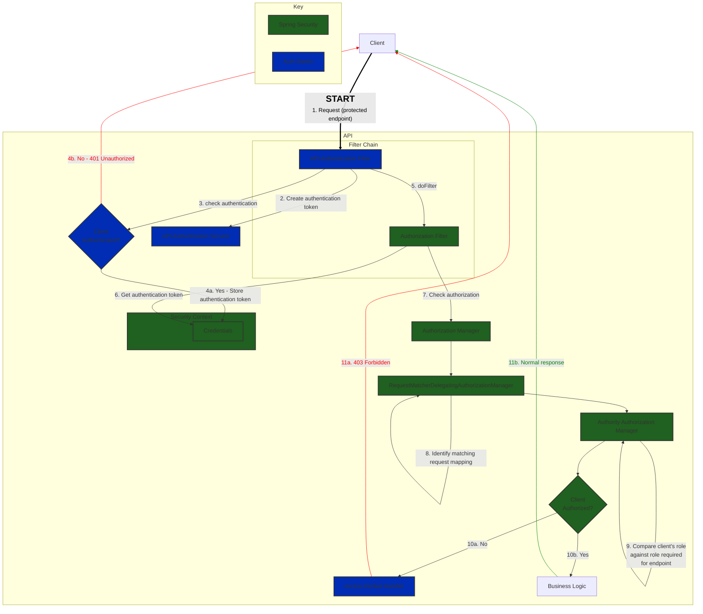

# LAA CCMS SpringBoot Authentication Starter

This starter will enable authentication on endpoints you have specified in your application configuration.
Roles can be defined to categorise groups of endpoints under different levels of access. These roles can then be assigned
to clients.

## Usage

### Declare the dependency

To enable this in your application, declare the following:

```groovy
dependencies {
    implementation 'uk.gov.laa.ccms.springboot:laa-ccms-spring-boot-starter-auth'
}
```

### Configure via application properties

Here you will need to define several properties to ensure authentication behaves as expected:

- `authentication-header` - The name of the HTTP header used to send and receive the API access token.
- `authorized-clients` - The list of clients who are authorized to access the API, and their roles. This is a JSON formatted string, with the top level being a list and each contained item representing a client's credentials, containing the name of the client, the roles it has access to and the access token associated with it.
- `authorized-roles` - The list of roles that can be used to access the API, and the URIs they enable access to. This is a JSON formatted string, with the top level being a list and each contained item representing an authorized role, containing the name of the role and the URIs that it enables access to.
- `unprotected-uris` - The list of URIs which do not require any authentication. These may be relating to API documentation, static resources or any other content which is not sensitive.

Access tokens should be generated as a `UUID4` string.

```yaml
laa.ccms.springboot.starter.auth:
  authentication-header: "Authorization"
  authorized-clients: '[
      {
          "name": "client1",
          "roles": [
              "GROUP1"
          ],
          "token": "b7bbdb3d-d0b9-4632-b752-b2e0f9486baf"
      },
      {
          "name": "client2",
          "roles": [
              "GROUP2"
          ],
          "token": "1fd84ad9-760d-401f-8cf0-7a80aa42566c"
      },
      {
          "name": "client3",
          "roles": [
              "GROUP1",
              "GROUP2"
          ],
          "token": "5d925478-a8a2-4b76-863a-3fb87dcbcb95"
      }
  ]'
  authorized-roles: '[
      {
          "name": "GROUP1",
          "URIs": [
              "/resource1/requires-group1-role/**"
          ]
      },
      {
          "name": "GROUP2",
          "URIs": [
              "/*/requires-group2-role/**"
          ]
      }
  ]'
  unprotected-uris: [ "/actuator/**", "/resource1/unrestricted/**" ]
```

## Behaviour

Authentication of endpoints will behave as follows.

### Unprotected URIs

Unprotected URIs will not require any authentication. Authentication headers will be ignored.

### Protected URIs

If a client attempts to access a protected URI, they will receive one of 3 responses depending on the scenario:

- Invalid or no access token present / wrong header used: 401 Unauthorized
- Valid access token present, client's role **does not** permit access to the requested URI or the URI does not exist: 403 Forbidden
- Valid access token present, client's role **does** permit access to the requested URI: 2XX (Success) / normal response



## OpenAPI Configuration

Included in the starter is an autoconfigured OpenAPI bean which will be set up with a security scheme for API key authentication that will be applied to all endpoints.

This will be enabled by default without any additional configuration, but can be disabled via application properties:

```yaml
laa.ccms.springboot.starter.open-api.security-scheme.enabled: false
```

This can be used if you would like to instead configure your own OpenAPI Bean.

However, if you would instead like to add to the provided bean, you can use OpenApiCustomizer from SpringDoc, e.g.

```java
@Bean
public OpenApiCustomizer customize() {
    return openApi -> {
      openApi.info(
          new Info()
              .title("API Title")
              .description("API Description")
              .version("API Version"));
    };
}
```
